- [Repository Info](#org3efd3b6)
- [Images](#org4000d6c)
- [Schematic](#org9702aa9)
- [PCB](#orgc4c3abc)
- [Bill of Materials](#org9a89b54)
- [Development](#org04cc7a2)

    <!-- This file is generated automatically from metadata -->
    <!-- File edits may be overwritten! -->

# Repository Info

-   Project Name: farseer\_pcb
-   Synopsis: Measures fly wingbeats using IR light reflected from flapping fly wings.
-   Documentation Version: 1.0.0
-   Pcb Version: 1.0
-   Enclosure Version: 1.0
-   Supplemental BOM Version: 1.0
-   Release Date: 2025-05-16
-   Creation Date: 2025-05-16
-   Kicad Version: 9.0.0
-   License: GPL-3.0
-   URL: <https://github.com/mechatronicmagic/farseer_pcb>
-   Author: Peter Polidoro
-   Email: peter@polidoro.io
-   Copyright: 2025 Peter Polidoro
-   References:
    -   [kicad](https://www.kicad.org/)
    -   [light\_sensor\_boards](https://github.com/janelia-kicad/light_sensor_boards)
    -   [wingbeat\_detector](https://github.com/peterpolidoro/wingbeat_detector)
-   Papers:
    -   [Active antennal movements in Drosophila can tune wind encoding](https://doi.org/10.1016/j.cub.2023.01.020)
    -   [A novel assay to evaluate action selection in escape behavior](https://doi.org/10.1016/j.jneumeth.2018.04.019)
    -   [Cellular evidence for efference copy in Drosophila visuomotor processing](https://doi.org/10.1038/nn.4083)
    -   [State-dependent decoupling of sensory and motor circuits underlies behavioral flexibility in Drosophila](https://doi.org/10.1038/s41593-019-0413-4)
    -   [Active flight increases the gain of visual motion processing in Drosophila](https://doi.org/10.1038/nn.2492)
    -   [An Optical Tachometer for Measurement of the Wing-Beat Frequency of Free-Flying Insects](https://doi.org/10.1242/jeb.82.1.377)

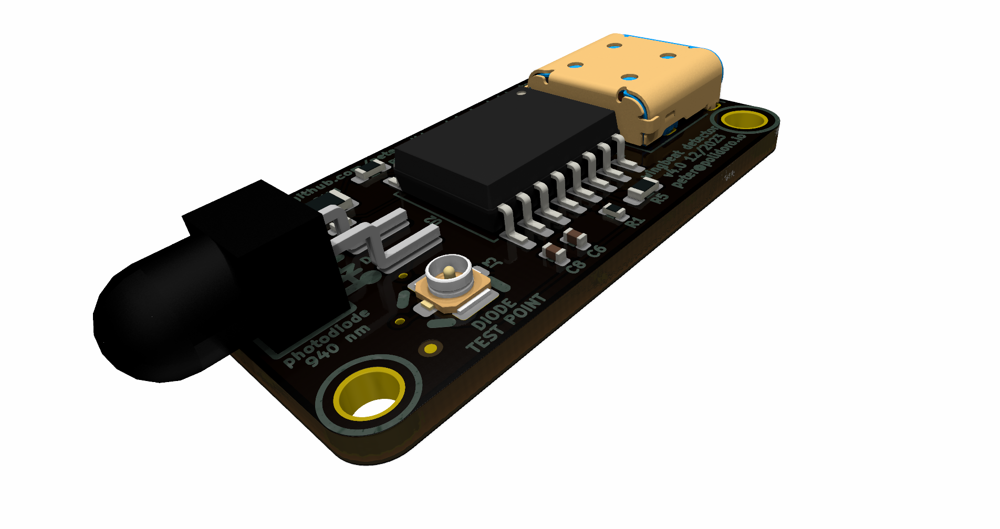

This wingbeat detector, or flight “tachometer”, is a small electro-optical device that uses reflected infrared light from the fly’s wingbeats to generate an oscillating voltage signal. The oscillation frequency of the voltage signal matches, and thus allows one to measure, the tethered fly's wingbeat frequency.

This device is useful for plate (rather than pin) tethered flight experiments, because with plate-glued flies, one cannot extract the wingbeat frequency via a classical wingbeat analyzer. Microphones have also been used for extracting wingbeat frequency, but they require a quiet room. This wingbeat detector is immune to audible noise and only requires an infrared light source, often already present on flight rigs for video recording.

One end of a small diameter light guide is mounted near the fly and aimed at the wings. The other end of the light guide is in a small enclosure containing an optical filter and printed circuit board and can be mounted off to the side of the rig wherever there is room.

The light guide brings light reflected off of the wings down to a photodiode on a circuit board, after passing through an optical filter to remove the unwanted wavelengths of light. Amplifiers and filters on the circuit board convert the tiny amounts of current from the photodiode into an oscillating voltage signal, with a frequency range of several hundred Hertz and a magnitude range of several Volts.

The oscillating voltage signal can be fed into a data acquisition card, oscilloscope, and/or a speaker for recording and instant feedback on fly wingbeat frequency. Using a threshold, the signal can be used as a simple boolean that indicates whether the tethered animal is flying or not for triggering experiments or synchronizing the data collection.

This device was first created at Caltech in the Dickinson lab in collaboration with Gaby Maimon around 2010. It has transformed over several generations, getting smaller and more robust each iteration. It has been used on rigs in multiple universities and research institutes and has been referenced in several papers. A couple of iterations were designed in collaboration with Sung Soo Kim and the Card lab at Janelia Research Campus. The latest version was created in collaboration with the Suver lab at Vanderbilt.

# Images

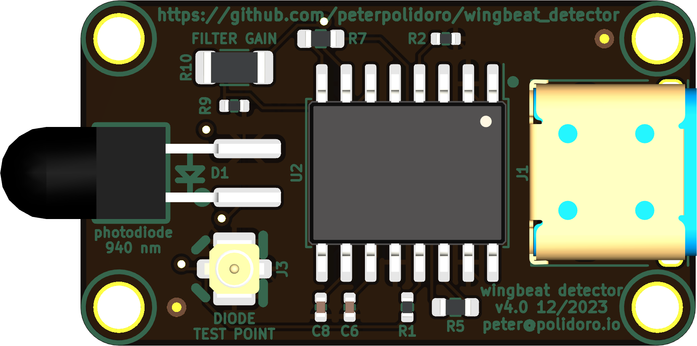

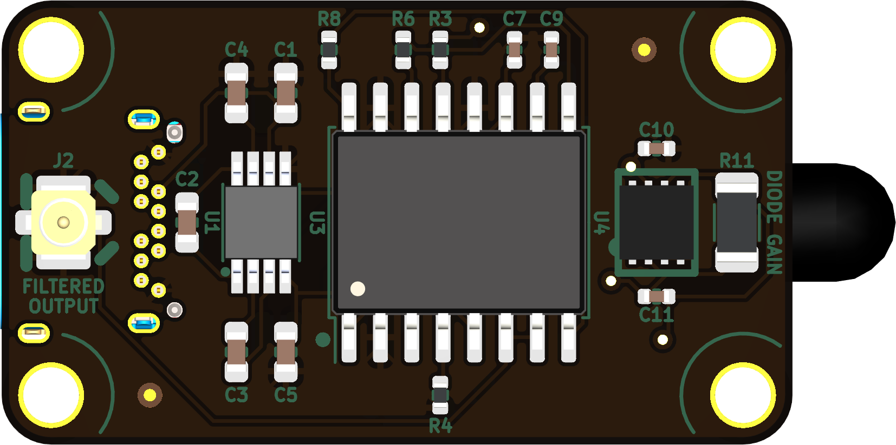

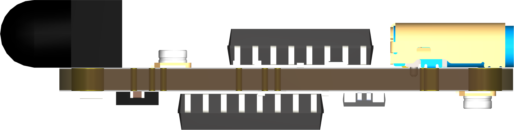

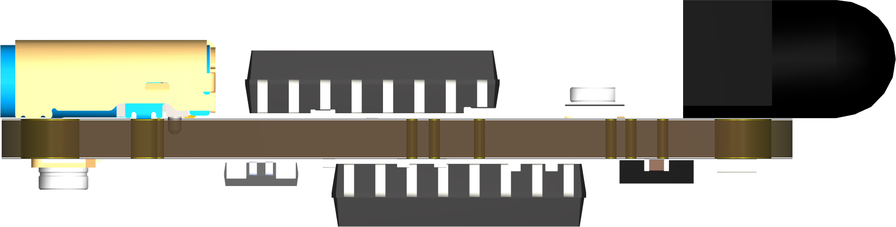

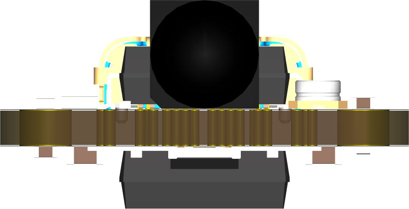

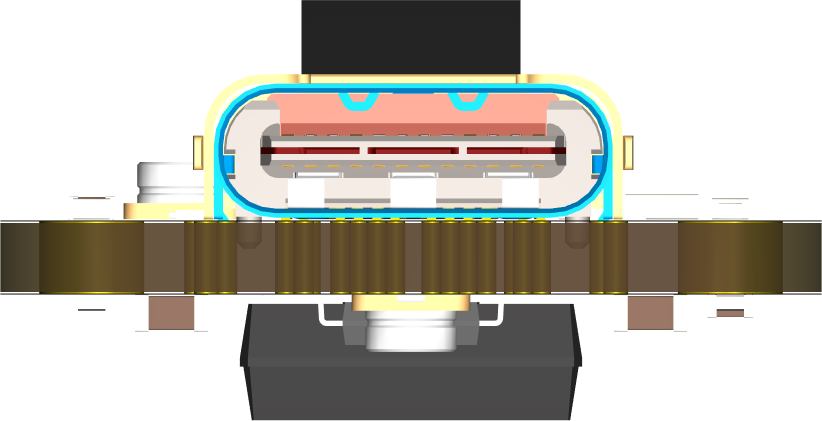

# Schematic

[./documentation/schematic/wingbeat\_detector.pdf](./documentation/schematic/wingbeat_detector.pdf)

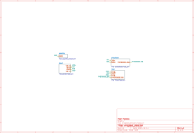

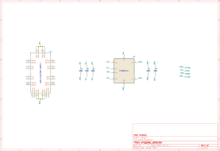

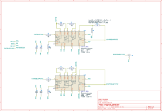

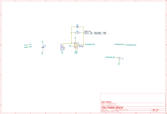

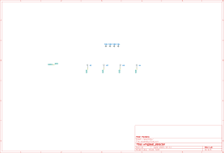

# PCB

# Bill of Materials

## Board

|    |
|--- |
|  |

## Supplemental

| Item | Description                        | Manufacturer Part Number | Manufacturer        | Quantity | Cost   | Total   |
|---- |---------------------------------- |------------------------ |------------------- |-------- |------ |------- |
| 1    | BNC STRAIGHT BULKHEAD JACK TO AM   | 095-850-210-150          | Amphenol RF         | 1        | 24.41  | 24.41   |
| 2    | AC/DC WALL MNT ADAPTER 5.1V 15W    | SC0445                   | Raspberry Pi        | 1        | 8.00   | 8.00    |
| 3    | CBL ASSY BNC PLUG-PLUG RG58 5'     | 5697-60                  | Pomona Electronics  | 1        | 21.29  | 21.29   |
| 4    | LLG 3 mm Core 420 - 2000 nm 1.2 m  | LLG3-4Z                  | thorlabs            | 1        | 392.69 | 392.69  |
| 5    | 3 mm LLG to SM1 Adapter            | AD3LLG                   | thorlabs            | 1        | 38.32  | 38.32   |
| 6    | Adapter External SM05 Internal SM1 | SM1A1                    | thorlabs            | 1        | 23.41  | 23.41   |
| 7    | SM05 Adjustable Lens Tube          | SM05V05                  | thorlabs            | 1        | 31.64  | 31.64   |
| 8    | 825nm 12.5mm Dia Longpass Filter   | 86-062                   | edmundoptics        | 1        | 194.00 | 194.00  |
| 9    | Universal probe holder             | MXB                      | siskiyou            | 1        | 275.00 | 275.00  |
| 10   | MACHINE SCREW PAN PHILLIPS 2-56    | PMSSS 256 0050 PH        | B&F Fastener Supply | 4        | 0.24   | 0.96    |
| 11   | HEX NUT 3/16" STN STEEL 2-56       | HNSS256                  | B&F Fastener Supply | 4        | 0.28   | 1.12    |
|      | Supplemental BOM Version: 1.0      |                          |                     |          | Total  | 1010.84 |

# Development

## Install Guix

[Install Guix](https://guix.gnu.org/manual/en/html_node/Binary-Installation.html)

## Edit metadata.org

    make metadata-edits

## Tangle metadata.org

    make metadata

## Edit project

    make kicad-edits
    exit

    make filter-edits
    exit
